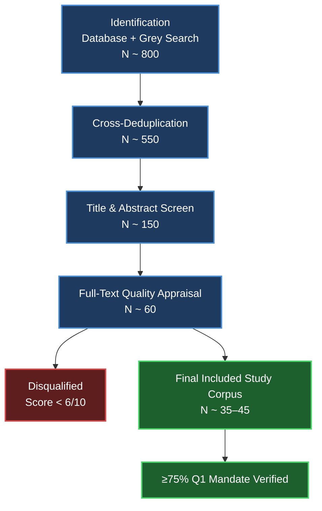

# A Comparative Analysis of Readiness-Based and Completion-Based I/O Models in the Linux Operating System: A Study of `epoll` and `io_uring`

---

> **Institution:** Obafemi Awolowo University — ComNet Laboratory  
> **Classification:** Research Protocol | Advanced System Research  
> **Department:** Computer Engineering | Faculty of Computing Science & Engineering  
> **Author:** Michael Awoniran  
> **Supervisor/Advisor:** Prof. Ayodeji Oluwatope  
> **Research Group:** Network Utility Maximization Subgroup, ComNet Laboratory  
> **Framework:** SALSA (Search, Appraisal, Synthesis, Analysis)  
> **Status:** `Under Review / In Preparation` *(May 2026)*

---

## Table of Contents

1. [Background & Structural Context](#1-background--structural-context)
2. [Search Strategy (SALSA — Search)](#2-search-strategy-salsa--search)
    - [2.1 Central Research Question](#21-central-research-question)
    - [2.2 Inclusion & Quality Criteria](#22-inclusion--quality-criteria)
    - [2.3 Search Databases](#23-search-databases)
    - [2.4 Boolean Search String](#24-boolean-search-string)
3. [Appraisal Framework (SALSA — Appraisal)](#3-appraisal-framework-salsa--appraisal)
4. [Synthesis & Analysis Plan](#4-synthesis--analysis-plan)
5. [PRISMA-SCR Expected Flow Continuum](#5-prisma-scr-expected-flow-continuum)

---

## 1. Background & Structural Context

Modern high-performance Linux applications, database engines, storage systems, and network proxies, historically leaned on **readiness-based I/O multiplexing** via the `epoll` interface (introduced in Linux 2.5.45). Under this model, the kernel notifies userspace that a file descriptor is *ready*; the application must then issue the actual I/O system call, incurring a **transaction round-trip cost** per unit.

In 2019, **`io_uring`** (merged in Linux 5.1) introduced a **completion-based asynchronous model** mapped across two shared-memory ring buffers: the **Submission Queue (SQ)** and the **Completion Queue (CQ)**. Applications write submission entries without blocking; the kernel consumes them asynchronously and posts completions. Through features like `SQPOLL` mode, `io_uring` can process entire I/O pipelines with **zero system calls**, offering deep architectural advantages over `epoll`.

---

### Table 1: `io_uring` Kernel Evolution Milestones

| Kernel Version | Feature Introduced | Research Significance |
|:---|:---|:---|
| **Linux 5.1** *(2019)* | Core ring buffer, basic file I/O | Initial architecture release. |
| **Linux 5.6** *(2020)* | Networked I/O, `SQPOLL` mode | Zero-syscall operation enabled via kernel threads. |
| **Linux 5.11** *(2021)* | Fixed buffers, registered files | Memory-pinning and fd registration optimizations. |
| **Linux 5.19** *(2022)* | Multishot operations | Single SQE produces multiple CQEs (e.g., continuous accepts). |
| **Linux 6.x** *(2023+)* | Direct descriptors, kernel workers | Full kernel-side pipeline control, cutting allocation locks. |

---

## 2. Search Strategy (SALSA — Search)

### 2.1 Central Research Question

> **How do readiness-based and completion-based I/O models compare in terms of performance, scalability, and implementation complexity in modern Linux systems?**

---

### 2.2 Inclusion & Quality Criteria

| Criterion | Requirement |
|:---|:---|
| **Temporal Boundary** | Papers published from May 2019 to present. |
| **Operating System Scope** | Hard-bounded to the Linux Kernel environment. |
| **Metrics Insisted** | Must explicitly isolate and report throughput (IOPS, MB/s), latency profiles (mean, p99 tail), CPU utilization, or syscall context-switching overhead. |
| **Q1 Journal Mandate** | A minimum of **75%** of included primary studies must originate from Q1-ranked journals or equivalent top-tier conference venues (CORE A★ or A), such as USENIX OSDI, USENIX ATC, USENIX FAST, ACM SOSP, ACM EuroSys, ACM SIGOPS, IEEE Transactions on Computers, HPCA, and PVLDB. |

---

### 2.3 Search Databases

| Database | Focus Area |
|:---|:---|
| **VLDB / PVLDB** | Database internals, storage engines, and transaction processing. |
| **ACM Digital Library / USENIX** | Primary repositories for core operating system and systems papers. |
| **IEEE Xplore / ScienceDirect** | Networking architectures and high-performance hardware-adjacent profiles. |

---

### 2.4 Boolean Search String

```text
("io_uring" OR "io_uring interface" OR "completion-based I/O" OR "libaio" OR "POSIX AIO")
AND ("epoll" OR "readiness-based I/O" OR "I/O multiplexing" OR "event-driven I/O" OR "event loop")
AND ("performance" OR "throughput" OR "latency" OR "scalability" OR "syscall overhead" OR "IOPS" OR "tail latency")
AND ("Linux" OR "kernel" OR "NVMe" OR "storage" OR "network" OR "file system")
AND ("benchmark" OR "comparison" OR "comparative" OR "evaluation")
```

---

## 3. Appraisal Framework (SALSA — Appraisal)

Every primary source is scored independently on an **ordinal scale** (0 = absent, 1 = partially met, 2 = fully met) across **5 core dimensions**. Studies scoring **below 6/10** are disqualified as primary synthesis sources.

| ID | Dimension | Scale | Description |
|:---:|:---|:---:|:---|
| **A1** | Workload Realism | 0–2 | Rejects uniform, synchronous micro-benchmarks. Demands mixed multi-threaded execution, variable payloads, and realistic connection states. |
| **A2** | Storage Baseline Media | 0–2 | Prioritizes testing deployed on NVMe arrays with kernel polling active. Legacy HDD or basic SATA SSD tests distort `io_uring`'s true capabilities. |
| **A3** | Kernel Phase Lifecycle | 0–2 | Requires explicit mapping of the kernel version used, cleanly separating pre-5.6 limitations from modern 6.x capabilities. |
| **A4** | Parity Ethics and Tuning | 0–2 | Ensures both pathways were compiled with equivalent optimization flags (e.g., edge-triggered `EPOLLET` vs naïve loops, balanced interrupts). |
| **A5** | Code Provenance | 0–2 | Mandates accessible code repositories for deep path verification. |

> **Disqualification threshold:** Studies scoring < 6 / 10 are excluded from the primary synthesis corpus.

---

## 4. Synthesis & Analysis Plan

- **Performance Trajectory Mapping** —> Chronologically mapping both interfaces across kernel shifts to visualize convergence.

- **Workload Pattern Matrices** —> Tabulating data outcomes categorized by resource profile (Network-bound vs Block Storage-bound).

- **Gap Identification** —> Documenting structural patterns and hardware configurations absent or underrepresented in Western literature, ensuring direct alignment with the sub-Saharan infrastructure and networking mandates of the ComNet Laboratory.

---

## 5. PRISMA-SCR Expected Flow Continuum



---

<div align="center">

*Obafemi Awolowo University · ComNet Laboratory · Network Utility Maximization Subgroup*  
*Department of Computer Engineering | Faculty of Computing Science & Engineering*

</div>