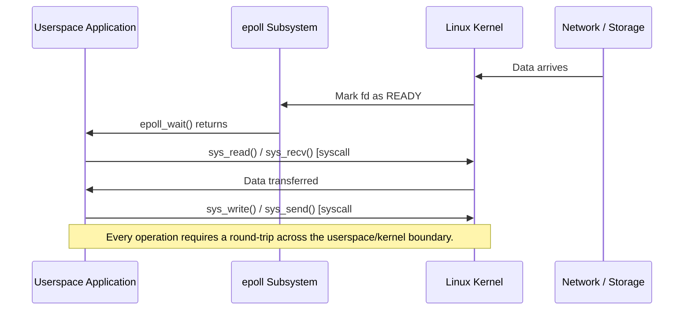
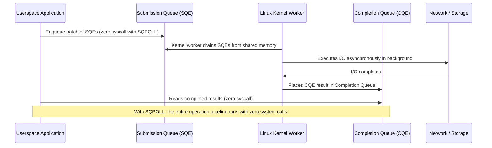
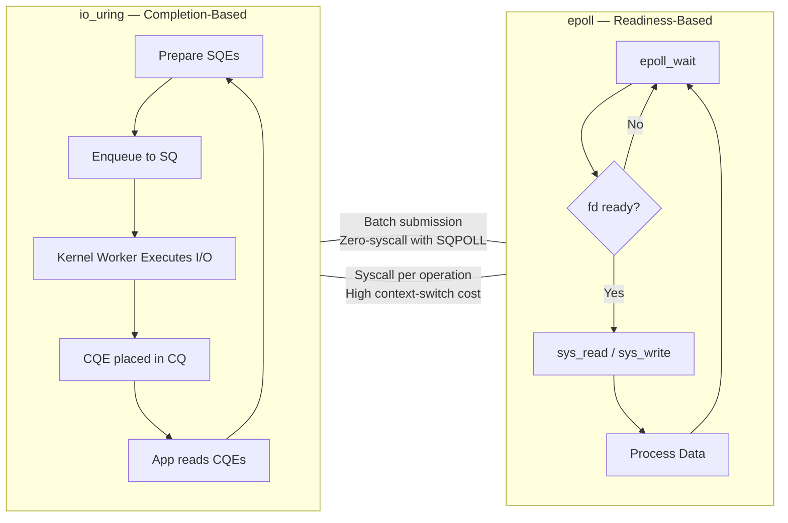
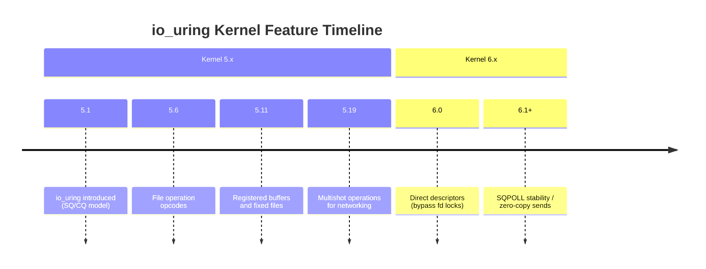

# Comparative Analysis of Readiness-Based (epoll) and Completion-Based (io_uring) I/O Models in the Linux Operating System

**A Scoping Review and Empirical Evaluation Harness**

---

> **Status: Work in Progress (WIP)**
>
> This repository contains active, unmerged academic research artifacts, clean-room primitives, and benchmark pipelines.
> Interfaces, documentation, and data schemas are subject to breaking changes as the empirical collection phase
> progresses.
>
> _Current Lifecycle Phase: Synthesis Protocol & Primary Appraisal Screening — Target Completion: November 2026_

---

## Affiliation

| Field              | Detail                                                |
|--------------------|-------------------------------------------------------|
| **Author**         | Michael Awoniran                                      |
| **Supervisor**     | Prof. Ayodeji Oluwatope                               |
| **Research Group** | Network Utility Maximization Subgroup                 |
| **Laboratory**     | ComNet Laboratory, Department of Computer Engineering |
| **Faculty**        | Faculty of Computing Science & Engineering            |
| **Institution**    | Obafemi Awolowo University, Ile-Ife, Nigeria          |
| **Lab Network**    | [comnet.oauife.edu.ng](https://comnet.oauife.edu.ng)  |

---

## Table of Contents

1. [Research Questions](#research-questions)
2. [Architectural Deep-Dive](#architectural-deep-dive)
3. [Development Philosophy: Tiger Style](#development-philosophy-tiger-style)
4. [Execution Pipelines](#execution-pipelines)
5. [Why These Questions Matter](#why-these-questions-matter)

---

## Research Questions

The empirical benchmarking suites and literature scoping framework (SALSA) are structured to answer the following four
research questions:

---

**RQ1 —> Concurrency Threshold & Throughput Crossover**

> At what concurrency levels (1,000 to 100,000 concurrent operations) does `io_uring` outperform `epoll` in terms of raw
> throughput (IOPS and MB/s), and at what exact saturation point does `epoll`'s system call frequency become the binding
> constraint on CPU utilization?

---

**RQ2 —> Tail Latency Profile and Latency Variance Under Saturation**

> How do tail latency (p95, p99, p999) and latency variance differ between readiness-based and completion-based I/O
> models when driven to saturation, and what is the statistical distribution shape of each model's latency under load?

---

**RQ3 —> Latency Stability Under Pressure**

> Does `io_uring` provide more stable, lower-variance latency than `epoll` under sustained and bursty high-pressure
> workloads, particularly in the presence of kernel context-switching cascades and ring buffer backpressure?

---

**RQ4 —> Syscall and CPU Overhead Per Operation**

> What is the exact system call count and CPU overhead per million operations for each I/O model, and how does this
> overhead evolve across Linux kernel generations (5.x baseline to 6.x with direct descriptors and `SQPOLL`)?

---

## Architectural Deep-Dive

To understand why these research questions are structured as they are, it is essential to map the foundational mechanics
of how `epoll` and `io_uring` behave inside the Linux kernel.

---

### The Readiness-Based Model: `epoll`

`epoll` is reactive. It acts as an event notification registry. When an application wants to read from or write to a
file descriptor, it asks `epoll` to monitor that descriptor. The kernel observes that data has arrived, marks the
descriptor as ready, and returns control to userspace, which must then issue a separate system call to move the bytes.



**The Bottleneck:** This dual-step process means every read or write cycle crosses the userspace/kernel boundary twice.
Under massive concurrent load, the CPU spends more cycles switching contexts and executing system call overhead than
routing data.

---

### The Completion-Based Model: `io_uring`

`io_uring` is proactive and decoupled. It does not notify you that you *can* do work, it notifies you that your work is
*already finished*. It operates using two lockless ring buffers shared directly between userspace and kernel memory: the
**Submission Queue (SQ)** and the **Completion Queue (CQ)**.



**The Optimization:** With Kernel Thread Polling (`SQPOLL`), a dedicated background kernel thread continuously drains
the Submission Queue. The application can process millions of operations with zero system calls.

---

### Side-by-Side: Execution Model Comparison



---

### Kernel Evolution: io_uring Feature Landscape

RQ4 directly depends on understanding how `io_uring` has evolved across kernel generations. The table below maps kernel
milestones to features exercised in this research.

| Kernel Version | Feature                                    | Research Relevance                 |
|----------------|--------------------------------------------|------------------------------------|
| 5.1            | `io_uring` introduced                      | Baseline for RQ1 throughput curves |
| 5.6            | `IORING_OP_OPENAT`, `IORING_OP_STATX`      | File I/O coverage                  |
| 5.11           | `io_uring` registered buffers, fixed files | Reduced syscall overhead           |
| 5.19           | Multishot `accept`, recv                   | High-concurrency networking        |
| 6.0            | Direct descriptors                         | Bypass kernel fd allocation locks  |
| 6.1+           | `SQPOLL` stability, zero-copy sends        | RQ4 zero-syscall baseline          |



---

### Latency Anatomy: Where Each Model Pays Its Cost

Understanding the latency structure of each model is central to RQ2 and RQ3.


The critical observation: `epoll`'s latency includes two mandatory kernel crossings per operation. `io_uring`'s latency
is dominated by the I/O itself, with the ring buffer overhead amortized across batches.

---

## Development Philosophy: Tiger Style

This repository does not use standard, casual development practices. To guarantee absolute hardware predictability,
mathematical certainty, and zero-hidden overhead, everything in this project is written in strict alignment with **Tiger
Style** pioneered by TigerBeetle.

**Zero Hidden Control Flow**

No macros, no operator overloading, and no implicit type conversions. Every branch and error path is fully explicit. The
reader of this code must never be surprised.

**Manual Memory Control and Zero Allocations at Runtime**

Static memory allocation strategies are enforced across both the `epoll` and `io_uring` loops. No `malloc` or heap
allocation occurs within the hot execution pathway. Non-deterministic latency spikes caused by the allocator are
eliminated at the design level, not papered over in analysis.

**Bound Predictability**

The Zig `0.13.0` toolchain is configuration-locked. Runtime safety bounds are stripped only under the explicit
`ReleaseFast` optimization flag when testing for raw, unfiltered hardware capabilities.

**Assertions as Absolute Invariants**

Code invariants are checked aggressively to catch system-level state corruption immediately at the edge of execution. A
failing assertion in this codebase does not represent a bug; it represents a violation of a formally stated assumption.

---

## Execution Pipelines

### Build and Verify

Compile the development CLI, verify constraints, and inspect code pathways:

```bash
zig build run
```

### Formal Benchmark Protocol

Execute the formal empirical benchmark pipeline in `ReleaseFast` optimization mode, runtime safety bounds stripped for
raw hardware truth:

```bash
zig build benchmark
```

The benchmark pipeline produces structured output suitable for statistical analysis: IOPS, MB/s, mean latency, p95, p99,
p999 tail latency, context switch counts, and system call frequency, all sampled at concurrency levels from 1,000 to
100,000 concurrent operations.

---

## Why These Questions Matter

**RQ1 and RQ3 —> Concurrency Crossover and Stability**

In production environments, the failure mode is not average performance — it is what happens at scale. At low
concurrency, `epoll`'s overhead is negligible. The research question is where the model collapses: the exact inflection
point at which system call frequency saturates the CPU and tail latency becomes non-deterministic. Because this codebase
uses Tiger Style (zero allocations in the hot path), the benchmarks isolate the I/O model's intrinsic cost from
allocator noise, producing a signal that is clean enough to characterize the crossover precisely.

**RQ2 —> Tail Latency Under Saturation**

When a network spike hits an `epoll`-based server, it triggers a cascade of context switches. The 99th percentile of
operations experiences disproportionate delay, not because the hardware is slow, but because the model serializes
notification and execution through the kernel boundary. RQ2 will produce full latency distribution histograms for both
models, characterizing not just where the tail is, but how fat it is and how it grows under pressure.

**RQ4 —> Syscall and CPU Overhead Across Kernel Generations**

`io_uring` has evolved significantly across kernel versions. Early 5.x implementations required fixed file setups and
carried measurable syscall overhead. Modern 6.x kernels, with direct descriptors and `SQPOLL`, eliminate entire classes
of overhead. RQ4 will produce a per-kernel-generation breakdown of syscall counts and CPU cycles per million
operations — a dataset that does not currently exist in the literature at this level of instrumentation precision.

---

_This document reflects the current state of the research as of the WIP phase. All experimental parameters, kernel
version targets, and hardware configurations are subject to revision prior to the empirical collection phase._